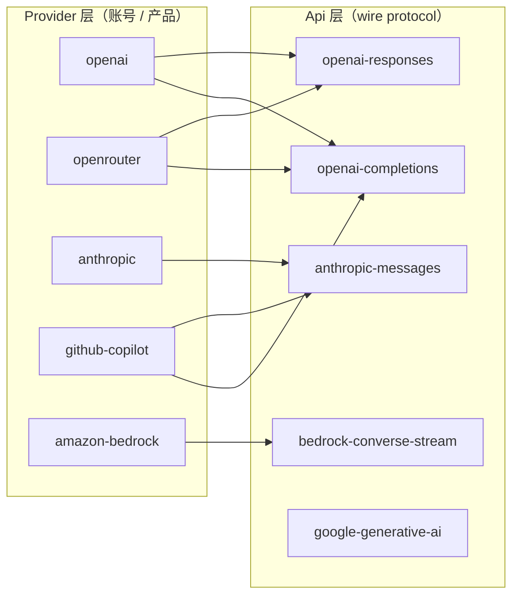
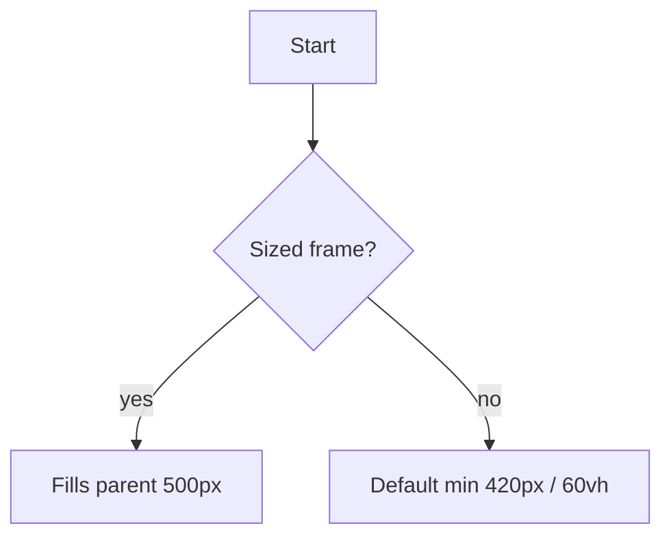

## Sandpack



{/* Custom viewport size: wrap fence with data-mermaid-frame + height/width classes */}

<div data-mermaid-frame className="h-[600px] w-full">

</div>

```tsx
"use client";

import { useTheme } from "next-themes";
import { MoonStarIcon } from "./animation-icons/moon-star-icon";
import { SumDimIcon } from "./animation-icons/sun-dim-icon";

export function ThemeSwitch() {
  const { resolvedTheme, setTheme } = useTheme();

  const handleChangeTheme = () => {
    setTheme(resolvedTheme === "light" ? "dark" : "light");
  };

  return (
    <div onClick={handleChangeTheme}>
      {resolvedTheme === "light" ? (
        <SumDimIcon className="cursor-pointer" />
      ) : (
        <MoonStarIcon className="cursor-pointer" />
      )}
    </div>
  );
}
```

```css
@layer components {
  .blog-wrapper {
    max-width: unset !important;
    grid-template-columns:
      1fr min(
        calc(var(--container-4xl) - var(--viewport-padding) * 2),
        calc(100% - var(--viewport-padding) * 2)
      )
      1fr;
    padding-inline: 0;
    grid-column-gap: var(--viewport-padding);

    > * {
      grid-column: 2;
    }
  }

  .bleed {
    width: 100%;
    max-width: var(--max-width, 68.75rem);
    grid-column: 1 / -1;
    padding-inline: var(--horizontal-padding, var(--viewport-padding));
    margin-inline: auto;
  }
}
```

<Sandpack template="react">

```js
import Gallery from "./Gallery.js";

export default function App() {
  return <Gallery />;
}
```

```js Gallery.js
export default function Gallery() {
  return <h1>Gallery</h1>;
}
```

```css
h1 {
  color: purple;
}
```

</Sandpack>
